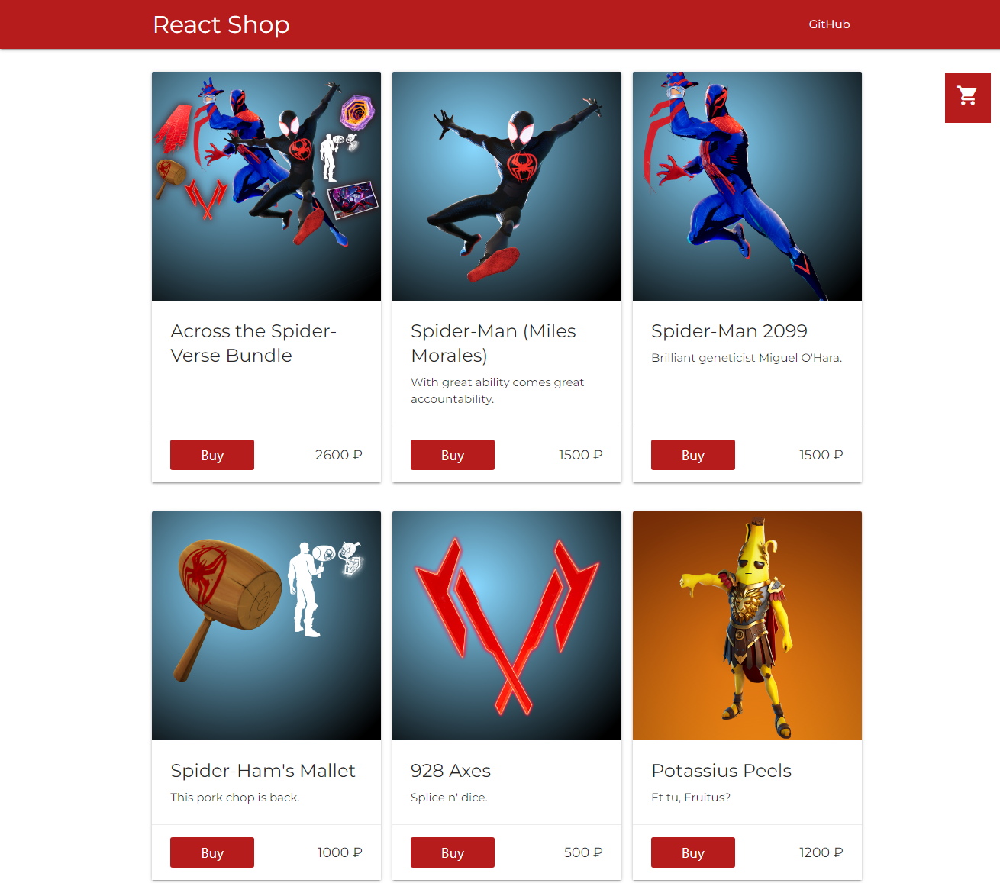
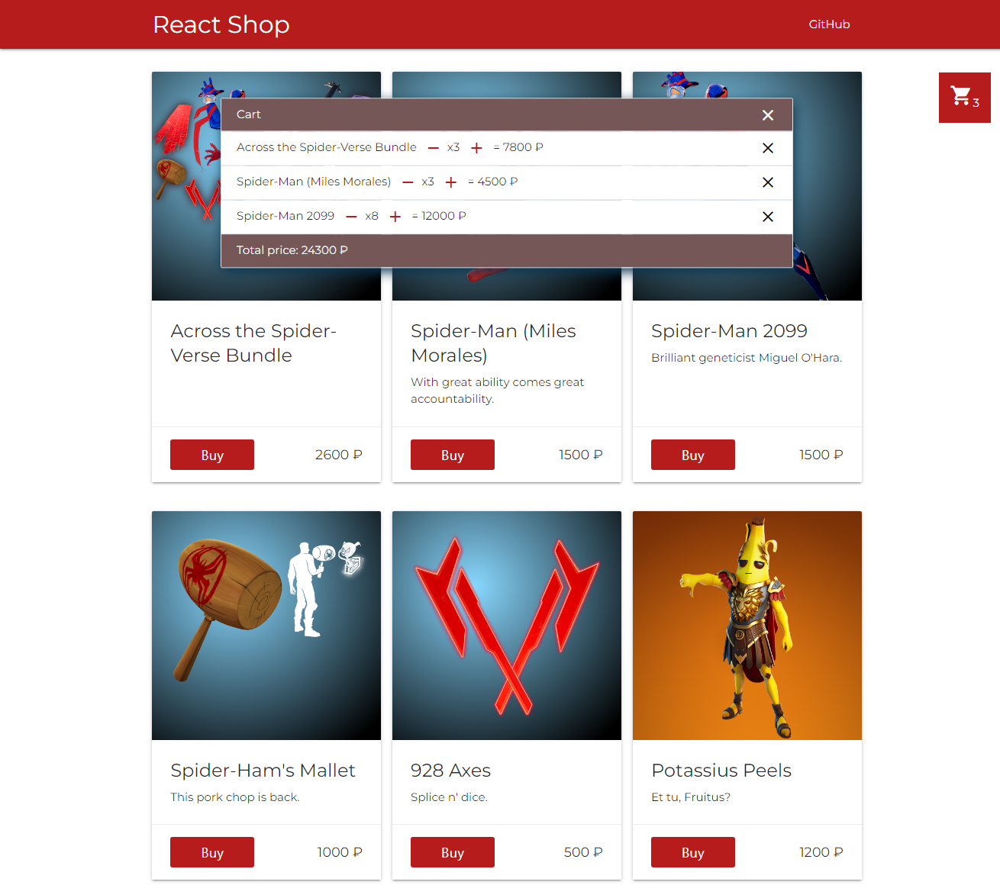

# React-shop

A simple application on Reactjs. Functional work with the cart was implemented. 
Adding, removing, increasing the number of items. Initially the useState hook was used to store the state. 
Then I rewrote it using the useState and useReducer hooks.

## fortniteapi

API - [fortniteapi](https://fortniteapi.io/)

This API is NOT official and NOT endorsed by Epic Games in any way.
All names, resources and generally any Fortnite related content belongs to Epic Games.

## css components

The Materialize framework was chosen as css components. Provides a set of default components with simple customization. 
A framework from Google was used as css components - [Materialize](https://materializecss.com/).

Link to the project - [React-shop](https://rebornoff.github.io/react-shop-practice/)

## Application Interface

## Cart

